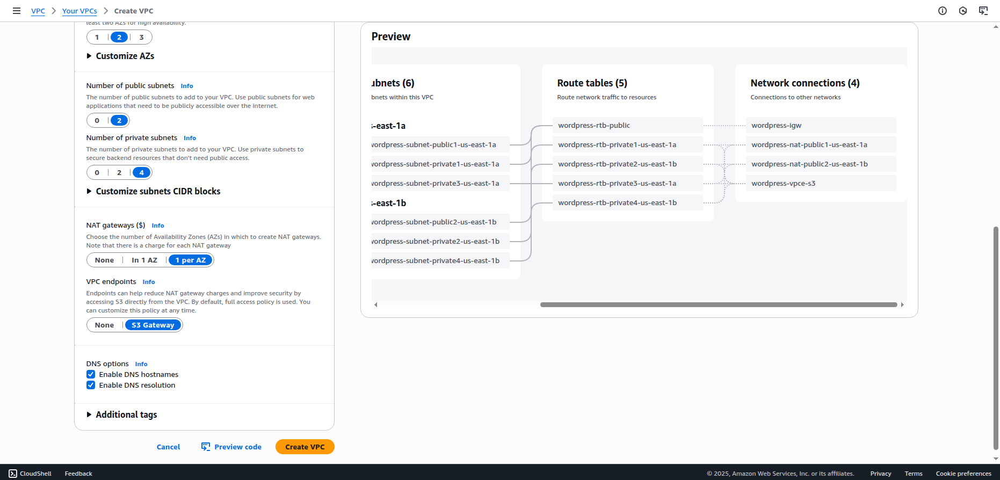

# Projeto Wordpress em alta-disponibilidade na AWS
    Implementação de infraestrutura para aplicação Wordpress em nuvem AWS com alta escalabilidade e disponibilidade.

## 🌐 Principais servicos e recursos utilizados:

- Docker com docker compose

- Wordpress (imagem docker hub)

- Instancias EC2 da AWS

- AWS Auto Scaling Group (ASG) e Application load balancer (ALB)

- Banco de dados relacional na nuvem AWS RDS com MySQL 8.0.42

- Sistemas de arquivos nuvem Amazon Elastic File System (EFS)

- Outros serviços AWS (IAM, SSM, VPC)

## Diagrama da arquitetura:


## 1. Criando a VPC (Virtual Private Cloud)

- Navegue até a área de VPC no console da AWS.

- Clique em "VPC's".


- Clique em "Create VPC".
- Selecione a opcao "VPC and more".


- Digite um nome para a sua VPC. Por exemplo: wordpress-vpc.

- Em "Number of Availability Zones (AZs)" marque 2.

- Em "Number of public subnets" marque 2.

- Em "Number of private subnets" marque 4.

- Em "NAT gateways ($)" marque "1 per AZ".

- Aperte o botao "Create VPC".



## 2. Criando os Security Groups
São possiveis duas abordagens aqui, criar todos os security groups nesse momento ou ir criando a medida que eles serão necessarios, fica a escolha do leitor, nesse documento todas as informações a respeito da criação dos Security Group estarão nessa seção. Todos devem ser criados na nova VPC. (se for seguir a criação de todos os SG agora, primeiro crie todos depois configure cada um)

### - EC2 Security Group
- Adicionar Inbound Rule. Type: SSH - Port: 22 - Source: Custom -> Bastion Host Security Group (OPCIONAL)

- Adicionar Inbound Rule. Type: HTTP - Port: 80 - Source: Custom -> ALB Security Group

### - RDS Security Group
- Adicionar Inbound Rule. Type: MYSQL/Aurora - Port: 3306 - Source: Custom -> EC2 Security Group

### - EFS Security Group
- Adicionar Inbound Rule. Type: NFS - Port: 2049 - Source: Custom -> EC2 Security Group

### - ALB Security Group
- Adicionar Inbound Rule. Type: HTTP - Port: 80 - Source: Anywhere IPv4

### - Bastion Host Security Group (OPCIONAL)
- Adicionar Inbound Rule. Type: SSH - Port: 22 - Source: My IP


## 3. Criando o banco de dados RDS MySQL
- Navegue ate "Aurora and RDS" no console da AWS

- Clique em "Databases" na barra de navegacao lateral ou "DB Instances".

- Clique em "Create database"

- Marque a caixa MySQL

- Descendo a pagina ate templates marque "Free tier"

- Dentro da aba "Settings" em "Credential settings" escolha um usuario e senha do banco de dados (importante guardar a senha do banco de dados para as etapas futuras)

- Logo abaixo na aba "Instance configuration" escolha o tamanho "db.t3.micro"

- Descendo um pouco mais na pagina em "Connectivity" selecione a VPC do projeto e o security group do RDS

- Indo ate o final da pagina, clique para expandir a aba "Additional configuration"

- Em "Additional configuration" procure pelo campo "Initial database name" e digite o nome do banco de dados

## 4. Criando o sistema de arquivos EFS
- Navegue ate "Amazon EFS" no console da AWS

- Clique em "FIle systems" na barra de navegacao lateral

- Clique em "Create file system"

- Aperte o botao "Customize"

- Desca ate o final da pagina e clique em "Next"

- Agora em "Network access" selecione a VPC do projeto, nas subnets marque as privadas e nos security groups escolha o nosso EFS Security Group

- Clique em "Next" novamente ate o final e entao "Create" para criar o EFS

## 5. Criando o EC2 Target Group
- No serviço EC2 no console AWS clique em "Target Groups" na aba "Load Balancing"

- Clique em "Create Target Group"

- Digite um nome para o target group. exemplo: wordpress-tg.

- Em VPC selecione a VPC correta desse projeto.

- Clique em "Next e então "Create target group".

## 6. Criando o Application Load  Balancer

- Navegue até Load Balancers e clique em "Create load balancer".

- Procure por "Application Load Balancer" e aperte em "Create".

- dê um nome ao Load Balancer. exemplo: wordpress-alb

- Em VPC selecione a VPC correta do projeto e marque as duas AZ (Availability Zone)

- Nas Subnets das AZ selecione a Subnet pública correspondente.

- Em Security Group selecione o ALB Security Group que criamos.

- Na aba "Listeners e routing" em "Target group" escolha o target group que criamos

- Desça até o final da página e clique em "Create load balancer".

## 7. Criando o IAM Role para a EC2
- Navegue até o serviço IAM (Identity and Access Management ) no console da AWS.

- Clique em "Roles" e então "Create role".

- Em "Service or use case" selecione "EC2" e clique em "Next" no final da página.

- Em "Permissions policies" procure por "EFS" e marque "AmazonEFSCSIDriverPolicy".

- Pesquise támbem por "AmazonSSMManagedInstanceCore" e marque essa opção.

- Desça novamente até o final da página e clique em "Next".

- Escolha um nome para a Role. Exemplo: wordpress-EC2-role.

- Clique em "Create role" para finalizar.

## 8. Configurando variaveis de ambiente com SSM Parameter Store
Todas as informações que são necessarias para criar as variaveis podem ser conferidas nos respectivos serviços associados a essas variaveis (com execessão da senha do banco de dados). Os parametros precisam seguir um padrão dos nomes iguais aos que serão comentados nessa etapa, dessa forma os codigos e configurações das etapas futuras podem funcionar corretamente.

- Navegue no AWS console até o serviço SSM (AWS Systems Manager)

- Na barra de navegação vá até "Application Tools" e clique em "Parameter Store"

- Clique em "Create parameter" para criar um novo parametro.

- Crie o parametro com o nome "/wordpress/alb_dns" contendo o endereco DNS do Load  Balancer

- Crie o parametro "/wordpress/db_host" contendo o Endpoint do banco de dados RDS

- Crie o parametro "/wordpress/db_name" contendo o nome do banco de dados MySQL (atenção, coloque o nome do banco de dados não o nome da instancia RDS)

- Crie o parametro "/wordpress/db_password" contendo a senha do banco de dados

- Crie o parametro "/wordpress/db_user" contendo o nome de usuario do banco de dados

- Crie o parametro "/wordpress/efs" contendo o id do EFS (Elastic file system)


## 9. Criando o Launch Template das intancias EC2
- Clique em "Launch templates" na aba "Instances" no serviço EC2 da AWS.

- Aperte "Create Launch Template" para criar um novo.

- Dê um nome identificavel ao template. Exemplo: wordpress-template

- Marque a caixa de "Auto Scaling guidance" para ajudar a configurar o launch template para ser usado em Auto Scaling.

- Em "Application and OS Images" clique em "Quick Start" e selecione "Amazon Linux".

- Em "Instance type" coloque t2.micro.

- em "Key Pair" clique em "create new key pair" digite um nome descritivo como wordpress-key, então aperte em "Create key pair" e salve a chave em um local do seu computador.

- No security group escolha o nosso EC2 Security Group.

- Desça até o final da página e clique para expandir "Advanced details".

- em "IAM instance profile" selecione o IAM role que criamos.

- Desça até o final novamente e em "user-data" cole o código do arquivo `user-data.sh` e então clique em "Create launch template".

```shell
#!/bin/bash
set -e
exec > >(tee /var/log/user-data.log|logger -t user-data -s 2>/dev/console) 2>&1

echo "INFO: Configurando variáveis de ambiente da AWS via SSM..."
export AWS_REGION="us-east-1"
export DB_HOST=$(aws ssm get-parameter --name "/wordpress/db_host" --with-decryption --query Parameter.Value --output text)
export DB_USER=$(aws ssm get-parameter --name "/wordpress/db_user" --with-decryption --query Parameter.Value --output text)
export DB_PASSWORD=$(aws ssm get-parameter --name "/wordpress/db_password" --with-decryption --query Parameter.Value --output text)
export DB_NAME=$(aws ssm get-parameter --name "/wordpress/db_name" --with-decryption --query Parameter.Value --output text)

export ALB_DNS_NAME=$(aws ssm get-parameter --name "/wordpress/alb_dns" --with-decryption --query Parameter.Value --output text)

export EFS_FILE_SYSTEM_ID=$(aws ssm get-parameter --name "/wordpress/efs" --with-decryption --query Parameter.Value --output text)
EFS_MOUNT_POINT="/mnt/efs"
WORDPRESS_DATA_DIR="${EFS_MOUNT_POINT}/wordpress"

echo "--- INICIANDO SCRIPT USER-DATA COMPLETO (EFS + DOCKER) ---"

echo "INFO: Atualizando o sistema..."
dnf update -y

echo "INFO: Instalando dependências (git, nfs, docker)..."
dnf install -y git unzip nfs-utils docker

echo "INFO: Instalando o repositório do AWS EFS..."
curl -fsSL https://repos.efs.aws/install | bash

echo "INFO: Instalando o amazon-efs-utils..."
dnf install -y amazon-efs-utils

echo "INFO: Criando o ponto de montagem ${EFS_MOUNT_POINT}..."
mkdir -p "${EFS_MOUNT_POINT}"

echo "INFO: Adicionando o EFS ao /etc/fstab para montagem automática..."
grep -qs "${EFS_FILE_SYSTEM_ID}" /etc/fstab || printf "${EFS_FILE_SYSTEM_ID}:/ ${EFS_MOUNT_POINT} efs tls,_netdev\n" >> /etc/fstab

echo "INFO: Montando todos os sistemas de arquivos listados no fstab (tentativas)..."
retryCnt=15; waitTime=30; while true; do mount -a -t efs,nfs4 defaults; if [ $? = 0 ] || [ $retryCnt -lt 1 ]; then echo "INFO: Sistemas de arquivos montados."; break; fi; echo "WARN: Falha ao montar, tentando novamente em ${waitTime}s..."; ((retryCnt--)); sleep $waitTime; done;

echo "INFO: Verificando se o EFS foi montado com sucesso..."
df -h | grep "${EFS_MOUNT_POINT}"

echo "INFO: Criando o diretório de dados do WordPress dentro do EFS..."
mkdir -p "${WORDPRESS_DATA_DIR}"
chmod 777 "${WORDPRESS_DATA_DIR}"

echo "INFO: Iniciando e habilitando o serviço do Docker..."
systemctl start docker
systemctl enable docker

DOCKER_COMPOSE_VERSION="v2.27.0"
echo "INFO: Baixando o Docker Compose ${DOCKER_COMPOSE_VERSION}..."
curl -L "https://github.com/docker/compose/releases/download/${DOCKER_COMPOSE_VERSION}/docker-compose-$(uname -s)-$(uname -m)" -o /usr/local/bin/docker-compose

echo "INFO: Aplicando permissões de execução ao Docker Compose..."
chmod +x /usr/local/bin/docker-compose

echo "INFO: Navegando para o diretório /root para instalar o AWS CLI..."
cd /root

echo "INFO: Clonando o repositório da aplicação..."
cd /root
git clone https://github.com/devbrunofernandes/wordpress-aws-pb.git
cd wordpress-aws-pb

echo "INFO: Subindo a aplicação com Docker Compose..."
docker-compose up -d

echo "--- SCRIPT USER-DATA FINALIZADO COM SUCESSO ---"
```

## 10. Criando o auto-scaling group
- No painel do serviço EC2 na AWS procure por "Auto Scaling Groups", a ultima opção na barra de navegação lateral, então clique em "Create Auto Scaling Group".

- No "Step 1" escolha um nome para o auto scaling group como wordpress-asg e selecione o Launch template que criamos.

- No "step 2" selecione a VPC do projeto e em "Availability Zones and subnets" escolha as Subnets privadas.

- No "step 3" em "load balancing" selecione "Attach to an existing load balancer" e selecione o target group que criamos anteriormente. Habilite a opção "Turn on Elastic Load Balancing health checks" e aumente o "Health check grace period" para 400 segundos.

- No "step 4" selecione o minimo e o maximo de instancias do auto scaling group. Exemplo: minimo 1 e maximo 4

- Pule os proximos passos e finalize a criação do Auto Scaling Group.

# Conclusão
Seguindo esses passos é criada uma infraestrutura completa em nuvem para hospedar uma aplicação web wordpress com segurança e alta disponibilidade do serviço. Além disso a utilização de nuvem permite facil escalabilidade dos recursos. Utilizando de banco de dados em nuvem a aplicação pode escalar caso necessario no futuro com recursos como multi-AZ e read-replicas e o auto scaling group pode ser configurado para se adequar as demandas de acessos do negocio.